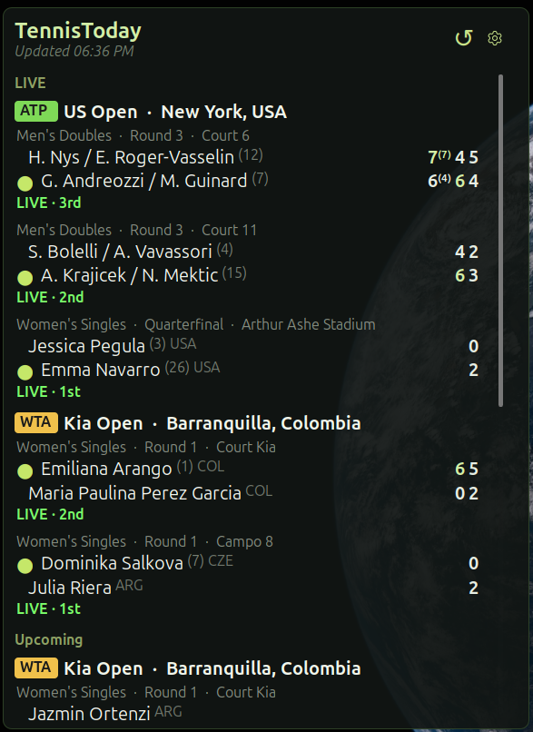

# TennisToday

A desklet that shows live, upcoming, and recently completed ATP and WTA tennis
matches on the Cinnamon desktop.

Scores come from ESPN's public tennis scoreboard.

## Features

- Live matches with set scores, tie-break scores, current game points, and a
  marker showing who is serving
- Today's upcoming matches with start times in your local timezone
- Recently completed matches, with the winner of each set highlighted
- Matches grouped by tournament, with round and court name where ESPN provides
  them
- Click a match to open it on ESPN

## Settings

**Tours**

- *Show ATP* / *Show WTA* / *Show Grand Slam* — pick which tours to display
- *Show doubles* — include doubles matches
- *Refresh interval* — how often to poll for new scores

**Display**

- *Max live matches*, *Max upcoming matches today*, *Max finished matches*
- *Minimum width* — the desklet grows beyond this to fit long score lines
- *Max height* — the match list scrolls past this height

Right-click the desklet for **Refresh now** and **Open ESPN scoreboard**.

## Installation

Install from **System Settings → Desklets → Download**, then add TennisToday to
the desktop from the **Manage** tab.

Desklets sit on the wallpaper, behind open windows — use show-desktop
(`Super+D`) if you cannot see it.

## License

[GPL-3.0-or-later](LICENSE)
